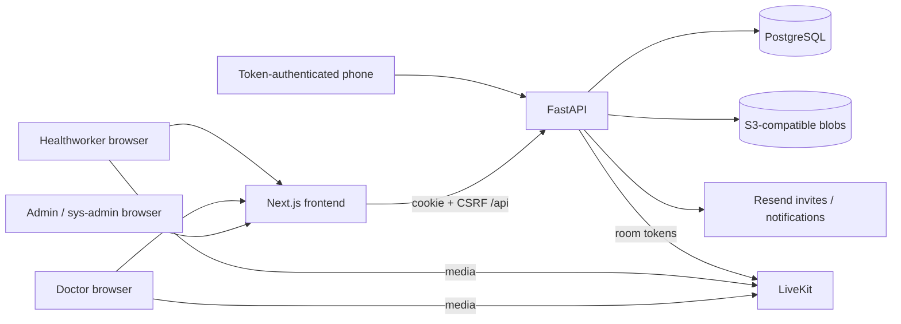

# HapuTele codebase walkthrough and feature inventory

This inventory describes implemented code, not roadmap promises. Storybook presents the existing UI with synthetic records; it does not establish clinical correctness, legal consent, server authorization, or production readiness. See [Storybook usage](STORYBOOK.md).

## Big picture

HapuTele supports healthworker-assisted telemedicine in Sri Lanka. Patients do not have accounts or a portal. A healthworker obtains consent, records patient demographics/history, schedules a doctor, collects vitals/photos, and hosts the patient-facing video participant. The doctor reviews that context, writes and signs a consultation, and optionally requests a follow-up. The healthworker can retrieve the signed prescription and daily exports.

Four authenticated roles share one login:

| Role | Landing route | Responsibilities |
| --- | --- | --- |
| Healthworker | `/healthworker/appointments` | Patients, consent, intake, queue, booking, availability, vitals, photos, meetings, prescriptions, exports |
| Doctor | `/doctor` | Own appointments, availability, patient review, consultations, signatures, follow-up, practice profile |
| Admin | `/admin` | Doctor invites, approval/rejection, clinical profiles and lifecycle; healthworker accounts |
| Sys-admin | `/sysadmin` | Institute configuration, own operator profile/password, operating accounts and doctor management |

The sys-admin is a database-enforced singleton created only during first-run setup. Admin and healthworker accounts are not singletons. Admins cannot create, see, reset, or manage other admins or the sys-admin. Doctors use separate clinical lifecycle endpoints rather than ordinary operating-account deletion.

## Architecture and reading order

1. **Routes and layout:** `frontend/src/app/layout.tsx` loads fonts and wraps `QueryProvider` / `AuthProvider`. `(app)/layout.tsx` performs presentation-level session/role gates and adds Topbar/version; each role layout supplies navigation. Public setup, onboarding and capture routes bypass the protected shell.
2. **UI modules:** `frontend/src/components/{primitives,healthworker,doctor,admin,accounts,sysadmin,doctors,consent,meeting,shell}` own forms and interactions. Pages compose them rather than defining a second component system.
3. **Frontend data seam:** `frontend/src/lib/use-api.ts` owns application queries, mutations and invalidation. `api.ts` and `generated-api-client.ts` implement cookie/CSRF transport and uniform `ApiError` handling. `types/api.ts` supplies stable names over generated contracts.
4. **Generated contract:** `frontend/src/gen` contains Kubb-generated models, clients and query factories. Backend Pydantic models are authoritative; `npm run generate:api` exports OpenAPI and regenerates this directory. Do not hand-edit it.
5. **Backend requests:** `backend/app/main.py`, `deps.py`, `security.py`, middleware and `routers/*.py` own setup gating, sessions, ACLs, clinical operations and uniform request-ID errors.
6. **Persistence:** `backend/app/models.py` maps relational and JSONB records. `backend/alembic/versions` owns schema constraints, indexes and migrations; `entrypoint.sh` runs migrations before Uvicorn.
7. **Integration modules:** `backend/app/services` owns runtime configuration, S3 blobs, LiveKit tokens/room cleanup, Resend email/invites, capture sessions, credential policy and readiness checks. `backend/app/pdf.py` generates prescriptions.
8. **Operations:** root `docker-compose.yml` runs Postgres, RustFS, API and frontend locally. `deployment/` uses Terraform + Ansible for one Lightsail VM, production Compose and Caddy TLS; production video uses self-hosted LiveKit or an external provider.

The API does not relay video media. Signatures, stamps and photos are in object storage and streamed through authenticated API routes, not publicly exposed URLs. Runtime institute identity/timezones/consent version are in `system_config`; infrastructure secrets are environment/.env/YAML settings.

## Complete route inventory

All paths below are real App Router routes. Dynamic numeric IDs reject malformed/nonpositive values and surface not-found, distinct from retryable load failures.

| Route | Implemented surface |
| --- | --- |
| `/` | Setup/session detection; redirects to setup, login or role home |
| `/login` | One username/password form; reveal/caps-lock hints, credential/disabled/pending/rejected errors, safe same-role `?next=` |
| `/setup` | One-time token → sys-admin/institute/timezones/consent version → optional repeated operating-account creation |
| `/doctor-onboarding/[token]` | Full new profile or password-only rotation; expired/consumed link and submission result |
| `/capture/[token]` | Public token-authenticated phone camera, JPEG capture, upload/retake and permission/expiry errors |
| `/healthworker` | Server redirect to appointments |
| `/healthworker/appointments` | Calendar, always-visible booking card, appointment rail, pending queue, focus, patient/queue context |
| `/healthworker/appointments/new` | Redirect to workspace, preserving optional `patientId` |
| `/healthworker/appointments/[id]` | Consent/vitals/photo/meeting/cancellation cockpit; completed prescription PDF |
| `/healthworker/patients` | Debounced search, roster, pagination, registration link, empty/no-match/loading/retry |
| `/healthworker/patients/new` | Signed master consent then demographic registration; decline exits without registration |
| `/healthworker/patients/[id]` | Demographics, profile summary, appointment history, book/edit/soft-delete |
| `/healthworker/patients/[id]/profile` | Conditions, surgery, allergies, existing medicines and lifestyle intake |
| `/healthworker/queue` | Pending/booked/cancelled backlog; source/priority filters; create, duplicate confirmation, book and cancel |
| `/healthworker/availability` | Selected doctor's weekly paint/erase planner, booked overlay, save and future-week copy |
| `/healthworker/exports` | Date-based medication `.xlsx` and signed prescription `.zip` downloads |
| `/admin` | Doctor status tabs, counts, open email invites, resend/revoke, approve/reject, profile links |
| `/admin/doctors/new` | Email invite or manual complete doctor creation |
| `/admin/doctors/[id]` | Profile/stamp/signature editing; approve/reject/reinvite/reapply/purge/deactivate/reactivate; audit metadata |
| `/admin/healthworkers` | Scoped operating-account roster, search, creation and management panels |
| `/doctor` | Own appointment calendar and identity greeting |
| `/doctor/appointments/[id]` | Waiting/ready/completed state; patient context, prior visits, begin consultation or locked record |
| `/doctor/consultations/[id]` | Three-stage notes/prescription/review editor; draft persistence, signing and follow-up; live call panel or locked review |
| `/doctor/availability` | Own weekly availability planner with save and pattern copy |
| `/doctor/profile` | Practice contact/qualifications/address/institute, stamp, saved signature; identity fields read-only |
| `/sysadmin` | Own operator profile/password plus institute identity/timezones/master consent version |
| `/sysadmin/accounts` | Mixed account roster, role/status/search/sort/stats, operating-account and doctor management panels |
| `/sysadmin/doctors/new` | Shared invite/manual doctor creation; `?mode=manual` selects full form |
| Unknown route / render failure | Branded not-found, route retry boundary and provider-independent root error boundary |

Source: files under `frontend/src/app`; the corresponding data operations are in `frontend/src/lib/use-api.ts` and `backend/app/routers`.

## Feature and user journey stories

### Operator: initialize a clinic

**Story:** As the installation operator, I can initialize a fresh clinic without any pre-seeded credentials.

1. An uninitialized visit redirects to `/setup`; non-setup domain API routes reject `setup_required`.
2. Verify the one-time container token. Receive a 15-minute setup-session bearer token held only in React memory.
3. Enter sys-admin credentials, institute name/address/phone/email, application/export timezones and master consent version.
4. Initialize once; the token is consumed, the system is sealed and the real operator session is created.
5. Optionally create multiple admin/healthworker accounts. Validation covers all intended rows; per-row failure does not replay already-created rows. Skip is supported.
6. Enter the system workspace. A stale setup tab cannot reinitialize the installation.

Sources: `app/setup/page.tsx`, `routers/setup.py`, `middleware/setup_gate.py`, `services/system_config.py`. Storybook: **Journeys / End to end / Initialize Clinic**, **Screens / Public / First Run Setup**.

### Staff: authenticate and recover

**Story:** As a staff member, one login takes me to my own workspace and preserves only a safe same-role return path.

Credentials are submitted verbatim, not trimmed. Password reveal and caps-lock hints are available. Invalid credentials do not reveal account existence. Correct-password owners see disabled/pending/rejected status. Unreachable bootstrap displays a retry screen rather than pretending the session expired. Sign-out posts logout then replaces the document to discard caches. Unsafe authenticated requests echo CSRF; backend ACLs remain authoritative.

Sources: `lib/auth.tsx`, `lib/api.ts`, `(app)/layout.tsx`, `routers/auth.py`, `deps.py`. Storybook: public login variants, four Topbar/RoleBadge roles, **Sign In And Search Patients**.

### Admin and doctor: invite, onboard and approve

**Story:** As an admin, I can invite a doctor to supply their own clinical identity, review it, and authorize practice.

- Email invite takes email plus optional family-name hint; no doctor row exists until submission. Open invites can be resent or revoked. The invited email is owned by the invite, not editable by the applicant.
- New onboarding requires credentials, name/contact, SLMC registration, qualifications, practitioner address, institute and stamp. Saved default signature is optional. Public onboarding permits local upload/camera, not authenticated QR session minting.
- Existing-doctor rotation is password-only. Invalid/expired/consumed links show unavailable state.
- Submitted profiles await approval; approve activates, reject records reason/actor/time and blocks sign-in. Rejected applications can reapply with a linked previous record or be permanently purged.
- Manual creation supplies a complete profile directly. Active doctors can be deactivated and reactivated without deleting historical care records.
- Stamp editor supports crop, 90-degree/fine rotation, background removal/threshold and image output. Signature input supports draw/upload, replace/clear, and size/type rejection.

Sources: `components/doctors/new-doctor-surface.tsx`, `components/admin/{doctor-form,rubber-stamp-editor,rubber-stamp-uploader}.tsx`, `doctor-onboarding/[token]/page.tsx`, `routers/{doctors,doctor_onboarding}.py`, `services/{doctor_invites,email,signature}.py`. Storybook: admin/public screens; **Invite Doctor And Return To Roster**, **Approve Doctor Application**.

### Healthworker: register a patient and record intake

**Story:** As a healthworker, I can obtain signed master consent before registering a patient's identity and medical history.

Consent statement and real pointer/touch/stylus signature precede demographics; an empty pad cannot continue. Decline returns to roster. Registration requires DOB (manual DD/MM/YYYY or calendar, no future date), names and gender, with language, National ID, contact, address and screening reference. Existing legacy records may lack DOB and expose correction. Patient search is debounced with 50-row pagination; no records and no matches differ. Edit and soft-delete preserve history. Intake supports named/other conditions, surgery rows, allergy type/name/treatment, existing drug/dosage/frequency, smoking/alcohol/betel-areca, occupation/activity. Repeaters add/remove entries. Profile summary and appointment history have real empty states.

Sources: patient routes, `components/healthworker/{patient-form,profile-form,profile-summary,patient-picker}.tsx`, `routers/patients.py`. Storybook: Clinical / Patients, all patient screens, **Register Patient With Consent**.

### Healthworker: manage backlog and book care

**Story:** As a healthworker, I can track screened/walk-in/follow-up patients before a concrete appointment exists and book from that backlog.

- Queue status is pending/booked/cancelled, source is screening/walk-in/follow-up, priority routine/urgent. Intake allows walk-in/screening; follow-up entries are system-created.
- Preferred doctor, target week and notes are optional. Duplicate pending entries produce a confirmation view; force is explicit. Cancel records optional reason.
- Queue booking locks patient, pre-fills doctor/target date and atomically creates an appointment while marking the queue entry booked. Workspace accepts `?bookFromQueue=`; patient booking accepts `?patientId=`.
- Fresh booking chooses registered patient, active doctor and a 15-minute slot. Patient context exposes existing appointments/pending entries to avoid accidental duplication.
- Calendar provides day/week/month/agenda views and focused rows. Availability bands are advisory, not a booking requirement. Custom outside-availability booking warns; booked/elapsed slots are unavailable. UTC transport is separate from clinic-local wall-clock entry.

Sources: queue/appointment routes, `components/healthworker/{appointment-form,appointment-calendar,patient-context,queue-entry-form,queue-book-form,queue-row}.tsx`, `components/doctor/doctor-slot-picker.tsx`, `routers/{queue,appointments,availability}.py`. Storybook: Clinical / Queue and Booking; workspace screens; **Book Pending Queue Entry**.

### Healthworker: prepare and conduct an appointment

The seven-state lifecycle is displayed by the real `StatusBadge` and mirrored by `AppointmentCockpit`:

| Status | User actions and gates |
| --- | --- |
| `scheduled` | Check/renew master consent, obtain signed session consent; declining cancels |
| `consent_pending` | Session consent already captured; collect primary complaint and plausible vitals |
| `data_collection` | Edit vitals/photos and start meeting; configured LiveKit must mint credentials successfully |
| `in_progress` | Join/reopen or end meeting; vitals are locked; patient-facing video tile belongs to healthworker |
| `awaiting_notes` | Doctor writes/signs consultation; photos remain available before terminal completion |
| `completed` | Locked consultation, signed prescription PDF preview/open/download; no cancel/edit |
| `cancelled` | Reason displayed; terminal/locked; no reopen |

Master consent is always visible and version-sensitive. Vitals include height/weight/BP/pulse/temperature with field-level validation and derived summary. Photo intake accepts JPEG/PNG/WebP via file picker, drag/drop, camera or phone QR; staging supports preview/rotation, sequential upload, caption edit/delete and lightbox. Cancellation can optionally requeue with doctor/week/priority/notes. Ending meeting manually or signed LiveKit room-finished webhook advances to awaiting notes. Closing a local call modal is not the same as ending the appointment.

Sources: `components/healthworker/{cockpit,vitals-form,attachments-panel}.tsx`, `components/meeting`, `routers/{appointments,preconsult,attachments,livekit_webhook}.py`. Storybook: seven cockpit/screen states, consent gates, attachment variants, meeting-unavailable behavior.

### Doctor: review, write, sign and follow up

**Story:** As the assigned doctor, I can review patient context, persist partial clinical notes, and produce a locked signed consultation with the appropriate follow-up.

1. Own calendar → appointment; wait for healthworker readiness. Review complaint/vitals, health profile, photos and previous visits.
2. Begin/get draft during live/awaiting-notes state. Consultation route may include a LiveKit call panel.
3. Notes → prescription → review. Notes capture complaint/onset/symptoms/observations. Structured prescription includes diagnoses, generic/trade names, dose/frequency/duration/instructions, labs and referrals.
4. Stage changes persist drafts; failed save prevents advancement. Blank untouched rows are dropped; nonempty medication without a generic name blocks signing.
5. Use saved signature or draw a one-off. Choose no follow-up, a concrete appointment, or recommendation in 1–52 weeks (quick presets available).
6. Submit locks consultation/appointment and atomically creates the optional follow-up appointment or queue entry. Completed records are read-only; signed PDF and daily exports become available.

Sources: doctor routes, `components/doctor/{consultation-flow,consultation-editors,consultation-review,consultation-stepper,patient-summary,visit-history}.tsx`, `routers/consultations.py`, `pdf.py`. Storybook: Clinical / Consultation, doctor screen variants, **Write Sign And Queue Follow Up**.

### Doctor and healthworker: plan availability

**Story:** As a doctor or healthworker, I can paint a weekly clinic pattern, save it and copy it into future weeks.

WeekGrid is seven days, 07:00–20:00, 30-minute cells; pointer-drag rectangles paint/erase, past dates are disabled, and booked cells are hatched without forbidding availability edits. Save replaces a visible week through range delete plus bulk create. Copy supports 1/2/4/8/12 future weeks and requires saved current state. Doctor can mutate only own windows; healthworker selects a doctor. Availability does not enforce booking times. Missing doctor, no active doctors, loading/query/save errors and dirty states are represented.

Sources: availability pages, `components/doctor/{week-grid,availability-grid-utils,doctor-slot-picker}`, `routers/availability.py`. Storybook: Clinical / Availability and both planner screens.

### Healthworker: deliver prescriptions and daily reports

**Story:** As a healthworker, I can open/download a completed signed prescription and export the day's completed consultations for medication pickup.

The cockpit streams `/appointments/{id}/summary.pdf` into an object URL and offers preview/open/download/retry. Exports convert a selected Sri Lanka day to UTC bounds; the server includes completed appointments only, limits range width, and returns real XLSX or a ZIP of signed PDFs plus manifest. Storybook downloads contain valid synthetic PDF/XLSX/ZIP files labelled nonclinical; they do not reproduce server formatting/filtering.

Sources: exports page, cockpit prescription viewer, `routers/{summary,exports}.py`, `pdf.py`. Storybook: completed cockpit/screen and export success/error surfaces.

### Operator: manage accounts and institute settings

**Story:** As an authorized operator, I can maintain staff access and the clinic's identity without granting myself a higher role.

Shared AccountsSurface provides search, role/status filter when applicable, sortable columns, statistics, empty/no-match recovery and selection panels. Manageable admin/healthworker rows expose profile update, password reset, disable/enable and confirmed delete; referenced accounts cannot be hard-deleted and should be disabled instead. Doctor panels use doctor-specific lifecycle/profile endpoints. Admin scope is healthworkers only; sys-admin may create admins/healthworkers and invite/manual-create doctors. Sys-admin self-profile/password has no disable/delete affordance. System config controls institute name/address/contact, display/export timezones and master consent version.

Sources: `components/accounts/accounts-surface.tsx`, `components/sysadmin`, `routers/{accounts,sysadmin}.py`. Storybook: admin/sys-admin screens; **Update Institute Identity**.

### Companion phone: capture images

**Story:** As an operator using a desktop, I can use a phone camera without registering or signing into the phone.

Desktop mints a short-lived purpose-scoped capture session and displays a QR; it polls status every 2.5 seconds and closes sessions on explicit close. Phone token is the credential, peeks purpose, requests permission, captures/downscales JPEG and posts multipart bytes. Appointment purpose permits repeated photos; rubber-stamp purpose relays a single image to the desktop crop editor. Expiry/revocation, unsupported/denied/busy camera, encoding/upload/relay failure and regeneration have explicit states. Storybook does not establish phone connectivity: generated links are inert preview tokens.

Sources: `components/primitives/{camera-capture-modal,qr-capture-modal}.tsx`, `capture/[token]/page.tsx`, `routers/capture.py`, `services/capture.py`. Storybook: primitive camera/QR states and public capture states.

## Shared UI foundations

All real primitive modules have Storybook entries: Button sizes/variants/states; Input/Label/password reveal/numeric behavior; native Select/Textarea; DatePicker day/week/min/max/keyboard; Card family; seven StatusBadges; ErrorBanner/ApiErrorBanner curated errors/reference/retry; EmptyState; PageHeader; BackLink; SectionLabel; CapsLockHint; explicit-close Modal; image preview; camera/QR capture; patient/doctor signature canvases and signature input. Shell stories cover Topbar, four RoleBadges, version visibility and login hero graphic. The existing Inter/Calistoga/JetBrains Mono faces and Tailwind semantic tokens are preserved and self-hosted in Storybook.

## Server-only capabilities and constraints

- `/health` is a dependency-free liveness probe with build metadata; `?full=true` concurrently checks Postgres/S3/configured LiveKit with bounded timeout, short cache and single-flight behavior. Swagger/ReDoc/OpenAPI expose the live contract.
- Cookie JWT plus double-submit CSRF; role ownership and disabled/onboarding gates are server-enforced. Password policy rejects whitespace/weak/short values at credential-setting seams. Setup, invite and capture raw tokens are short-lived/hashed/single-use or purpose-scoped.
- Database constraints own sys-admin singleton, username whitespace, National ID/live email/doctor-slot uniqueness, consent scope/signature and queue state shape. Availability is advisory. Domain transitions and atomic completion/follow-up/book-from-queue are backend behavior, not validated by fixture handlers.
- Signed LiveKit webhook finalizes rooms idempotently; signed Resend callbacks process delivery suppression. Invite rotation revokes old links; hard bounce/complaint suppression is backend-only.
- Blob limits: signature PNG 200 KiB; stamp PNG/JPEG 1 MiB; appointment/capture JPEG/PNG/WebP 10 MiB. Blob/DB commits can leave orphan objects on partial failure; missing blobs surface errors.

Sources: `backend/app/{main,deps,security,schemas,models,errors}.py`, middleware, services and Alembic migrations.

## Not implemented in this snapshot

Do not present these as Storybook features: patient portal/login; independent patient video identity; general audit-log viewer; metrics/tracing/alerts; backup/restore/PITR UI/job; horizontal replicas; worker/scheduler; active appointment-reminder dispatch. Reminder templates, notification-log schema and scheduled-email helpers exist but have no executing reminder pipeline. `components/shell/phase-placeholder.tsx` renders coming-soon content but no application route uses it. README's broad sys-admin logs/backups/observability description exceeds the actual `/me` and `/system-config` router.

LiveKit, Resend, PostgreSQL and object storage require separately configured runtime services. Camera/device behavior requires appropriate browser permissions and secure context. Storybook documents and exercises UI boundaries without claiming those integrations work.
